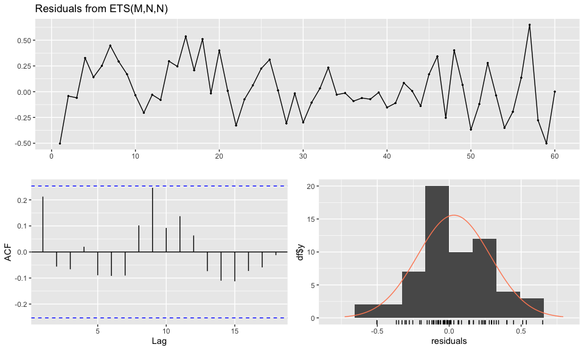
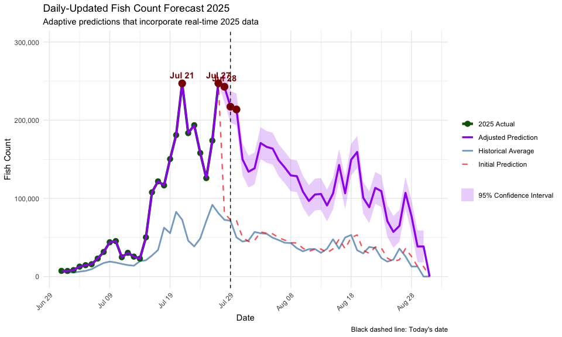
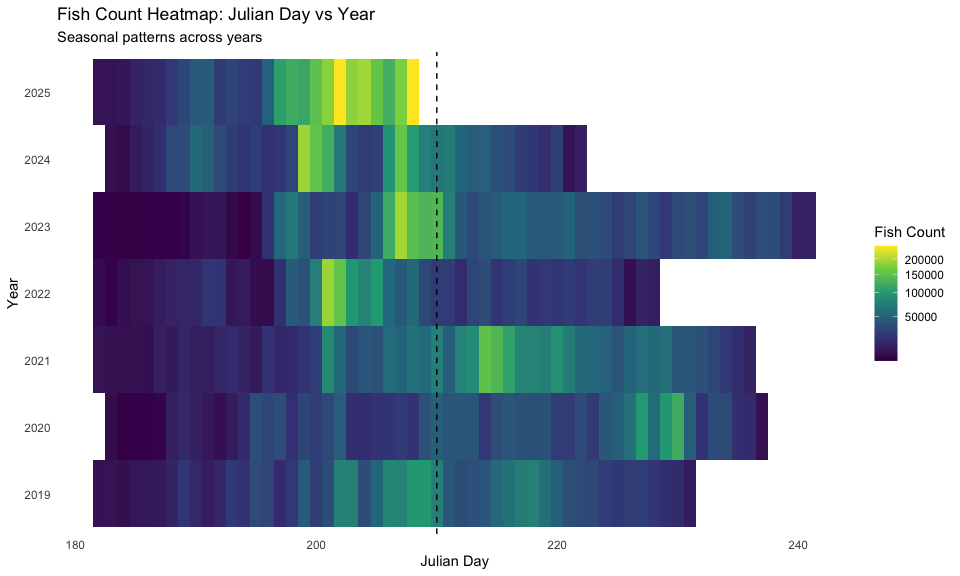

Kenai River Sockeye Salmon Count Forecasting: Daily Fish Count
Predictions
================
Joe Hicks
updated: 2025-07-18

- [Summary](#summary)
- [Data Loading & Preparation](#data-loading--preparation)
  - [Load Required Libraries](#load-required-libraries)
  - [Fetch Real-Time Fish Count Data](#fetch-real-time-fish-count-data)
- [Historical Pattern Analysis](#historical-pattern-analysis)
  - [Seasonal Analysis by Julian Day](#seasonal-analysis-by-julian-day)
  - [Peak Day Identification](#peak-day-identification)
- [Time Series Forecasting Models](#time-series-forecasting-models)
  - [ETS Model for Seasonal Pattern](#ets-model-for-seasonal-pattern)
- [Daily-Updated Forecasting System](#daily-updated-forecasting-system)
  - [The Challenge](#the-challenge)
  - [Data Integration Strategy](#data-integration-strategy)
  - [Historical ETS Model for Summer
    Period](#historical-ets-model-for-summer-period)
  - [Adaptive Prediction System](#adaptive-prediction-system)
  - [Peak Predictions for 2025](#peak-predictions-for-2025)
- [Visualization & Results](#visualization--results)
  - [Daily-Updated Forecast Plot](#daily-updated-forecast-plot)
  - [Historical Context
    Visualizations](#historical-context-visualizations)
    - [Annual Peak Analysis](#annual-peak-analysis)
    - [Season Overview Heatmap](#season-overview-heatmap)
- [Model Performance & Validation](#model-performance--validation)
  - [Forecast Accuracy Metrics](#forecast-accuracy-metrics)

# Summary

This analysis provides daily-updated forecasts for Kenai River sockeye
salmon counts, specifically targeting the July-August peak fishing
period. The model incorporates:

- **Historical patterns** from 2019-2024
- **Real-time 2025 data** for continuous model updates
- **ETS time series modeling** for seasonal pattern recognition
- **Adaptive predictions** that adjust based on 2025 performance vs
  historical

**Key Goal**: Predict optimal fishing dates for 2025 summer peak period,
with daily updates as new data becomes available.

------------------------------------------------------------------------

# Data Loading & Preparation

## Load Required Libraries

``` r
library(tidyverse)
library(lubridate)
library(jsonlite)
library(forecast)
library(tseries)
library(knitr)
library(scales)
library(broom)
```

## Fetch Real-Time Fish Count Data

The Alaska Department of Fish & Game provides live fish count data via
API. We pull data from 2019-2025 for the Kenai River sockeye salmon
counting station.

``` r
# Alaska Department of Fish & Game API endpoint
url <- "https://www.adfg.alaska.gov/sf/FishCounts/index.cfm?ADFG=export.JSON&countLocationID=40&year=2025,2024,2023,2022,2021,2020,2019&speciesID=420"

# Fetch and parse JSON data
raw_data <- fromJSON(url)

# Clean and structure the data
fish_data <- raw_data$DATA |>
  as_tibble(.name_repair = "minimal") |>
  set_names(raw_data$COLUMNS) |>
  transmute(
    date = as.Date(COUNTDATE, format = "%B, %d %Y %H:%M:%S"),
    fish_count = as.integer(FISHCOUNT)
  ) |>
  arrange(date) |>
  mutate(
    year = year(date),
    julian_day = yday(date)  # Day of year (1-365) - key variable for seasonal analysis
  )
```

------------------------------------------------------------------------

# Historical Pattern Analysis

## Seasonal Analysis by Julian Day

Understanding the seasonal pattern is crucial for predicting peaks. We
analyze fish counts by Julian day (day of year) across all historical
years.

``` r
# Aggregate fish counts by Julian day across all years
julian_analysis <- fish_data |>
  group_by(julian_day) |>
  summarise(
    n = n(),
    avg_count = mean(fish_count, na.rm = TRUE),
    median_count = median(fish_count, na.rm = TRUE),
    max_count = max(fish_count, na.rm = TRUE),
    min_count = min(fish_count, na.rm = TRUE),
    sd_count = sd(fish_count, na.rm = TRUE),
    years_observed = n(),
    .groups = 'drop'
  ) |>
  mutate(
    # Convert Julian day to 2025 dates for easier interpretation
    date_2025 = as.Date(julian_day - 1, origin = "2025-01-01"),
    month_day = format(date_2025, "%m-%d")
  )
```

## Peak Day Identification

Identify the top peak days based on historical averages to understand
the fishing season structure.

``` r
# Find the top peak days based on average counts
peak_days <- julian_analysis |>
  arrange(desc(avg_count)) |>
  slice_head(n = 15) |>  # Top 15 peak days
  mutate(
    peak_rank = row_number(),
    peak_category = case_when(
      peak_rank <= 5 ~ "Highest Peaks",
      peak_rank <= 10 ~ "High Peaks",
      TRUE ~ "Moderate Peaks"
    )
  )

# Display top peak days
peak_days |>
  select(peak_rank, date_2025, julian_day, avg_count, peak_category) |>
  mutate_if(is.numeric, round, 0) |>
  kable(caption = "Top 15 Historical Peak Days")
```

| peak_rank | date_2025  | julian_day | avg_count | peak_category  |
|----------:|:-----------|-----------:|----------:|:---------------|
|         1 | 2025-07-26 |        207 |     91785 | Highest Peaks  |
|         2 | 2025-07-20 |        201 |     82695 | Highest Peaks  |
|         3 | 2025-07-27 |        208 |     81109 | Highest Peaks  |
|         4 | 2025-07-21 |        202 |     72705 | Highest Peaks  |
|         5 | 2025-07-28 |        209 |     72584 | Highest Peaks  |
|         6 | 2025-07-29 |        210 |     71401 | High Peaks     |
|         7 | 2025-07-25 |        206 |     71100 | High Peaks     |
|         8 | 2025-07-18 |        199 |     62530 | High Peaks     |
|         9 | 2025-08-02 |        214 |     57054 | High Peaks     |
|        10 | 2025-07-19 |        200 |     55535 | High Peaks     |
|        11 | 2025-08-03 |        215 |     55390 | Moderate Peaks |
|        12 | 2025-08-04 |        216 |     54668 | Moderate Peaks |
|        13 | 2025-08-18 |        230 |     53227 | Moderate Peaks |
|        14 | 2025-07-30 |        211 |     50099 | Moderate Peaks |
|        15 | 2025-08-17 |        229 |     49912 | Moderate Peaks |

Top 15 Historical Peak Days

# Time Series Forecasting Models

## ETS Model for Seasonal Pattern

We use Exponential Smoothing State Space (ETS) models to capture the
seasonal pattern and create baseline predictions.

``` r
# Create a time series from the historical Julian day averages
julian_ts <- ts(julian_analysis$avg_count, frequency = 1)
ets_model <- ets(julian_ts)

# Create tidy() method for ets models
tidy.ets <- function(x, ...) {
  tibble(
    method = x$method,
    aic = round(x$aic, 2),
    sigma2 = round(x$sigma2, 2),
    loglik = round(x$loglik, 2)
  )
}

# Display model summary using tidy()
tidy(ets_model) |>
  kable(caption = "ETS Model Summary")
```

| method     |     aic | sigma2 |  loglik |
|:-----------|--------:|-------:|--------:|
| ETS(M,N,N) | 1330.62 |   0.07 | -662.31 |

ETS Model Summary

``` r
# Model diagnostics
checkresiduals(ets_model)
```

<!-- -->

    ## 
    ##  Ljung-Box test
    ## 
    ## data:  Residuals from ETS(M,N,N)
    ## Q* = 15.856, df = 10, p-value = 0.1038
    ## 
    ## Model df: 0.   Total lags used: 10

- ✅ No significant autocorrelation in residuals
- ✅ Model captured the main patterns in the data
- ✅ Residuals look like white noise (random)
- ✅ Good model fit from a statistical perspective

------------------------------------------------------------------------

# Daily-Updated Forecasting System

## The Challenge

Traditional forecasting uses only historical data. However, we want to
**update predictions daily** as new 2025 data becomes available. This
allows us to:

1.  **Incorporate real observations** from 2025
2.  **Adjust predictions** based on whether 2025 is running high/low vs
    historical
3.  **Improve accuracy** as the season progresses

## Data Integration Strategy

``` r
# Get actual 2025 data observed so far (July-August focus)
actual_2025_summer <- fish_data |>
  filter(year == 2025, julian_day >= 182, julian_day <= 243) |>
  select(julian_day, actual_2025_count = fish_count, date) |>
  arrange(julian_day)

# Get historical July-August data (excluding 2025)
historical_summer <- fish_data |>
  filter(year != 2025, julian_day >= 182, julian_day <= 243) |>
  group_by(julian_day) |>
  summarise(
    historical_avg = mean(fish_count, na.rm = TRUE),
    historical_sd = sd(fish_count, na.rm = TRUE),
    n_years = n(),
    .groups = 'drop'
  )

# Create complete July-August dataset
summer_combined <- tibble(julian_day = 182:243) |>
  left_join(historical_summer, by = "julian_day") |>
  left_join(actual_2025_summer, by = "julian_day") |>
  mutate(
    # Fill missing historical data with 0
    historical_avg = coalesce(historical_avg, 0),
    historical_sd = coalesce(historical_sd, 0),
    # Create date columns
    date_2025 = as.Date(julian_day - 1, origin = "2025-01-01"),
    month_day = format(date_2025, "%m-%d"),
    # Current date for determining observed vs predicted
    current_julian = yday(Sys.Date()),
    # Data availability status
    data_status = case_when(
      !is.na(actual_2025_count) ~ "Observed 2025",
      julian_day <= current_julian ~ "Available (not yet observed)",
      TRUE ~ "Future prediction"
    )
  )
```

## Historical ETS Model for Summer Period

``` r
# Create ETS model on historical data only
historical_ts <- ts(summer_combined$historical_avg, frequency = 1)
historical_ets <- ets(historical_ts)

# Display model summary using tidy()
tidy.ets(historical_ets) |>
  kable(caption = "ETS Model Summary")
```

| method     |     aic |    sigma2 |  loglik |
|:-----------|--------:|----------:|--------:|
| ETS(A,N,N) | 1406.47 | 107601717 | -700.24 |

ETS Model Summary

``` r
# Model diagnostics
checkresiduals(historical_ets)
```

<!-- -->

    ## 
    ##  Ljung-Box test
    ## 
    ## data:  Residuals from ETS(A,N,N)
    ## Q* = 12.19, df = 10, p-value = 0.2725
    ## 
    ## Model df: 0.   Total lags used: 10

- ✅ No significant autocorrelation in residuals
- ✅ Model captured the main patterns in the data
- ✅ Residuals look like white noise (random)
- ✅ Good model fit from a statistical perspective

## Adaptive Prediction System

Create predictions that adapt based on 2025 performance.

``` r
# Enhanced predictions that incorporate 2025 data
summer_predictions <- summer_combined |>
  mutate(
    # Get ETS fitted values for historical pattern
    ets_fitted = as.numeric(historical_ets$fitted),
    # Use actual 2025 where available, ETS prediction otherwise
    predicted_count = case_when(
      !is.na(actual_2025_count) ~ actual_2025_count,
      TRUE ~ ets_fitted
    ),
    # Calculate residuals from 2025 vs historical to adjust future predictions
    residual_sd = sqrt(historical_ets$sigma2),
    # Enhanced confidence intervals
    lower_95 = case_when(
      !is.na(actual_2025_count) ~ actual_2025_count,
      TRUE ~ predicted_count - 1.96 * residual_sd
    ),
    upper_95 = case_when(
      !is.na(actual_2025_count) ~ actual_2025_count,
      TRUE ~ predicted_count + 1.96 * residual_sd
    )
  )

# Update predictions based on 2025 performance so far

# Calculate how 2025 is performing vs historical
performance_comparison <- summer_predictions |>
  filter(!is.na(actual_2025_count)) |>
  mutate(
    ratio_2025_to_historical = actual_2025_count / historical_avg,
    ratio_2025_to_historical = ifelse(is.infinite(ratio_2025_to_historical), 1, ratio_2025_to_historical)
  )

# Get recent trend in 2025 vs historical
recent_performance <- performance_comparison |>
  slice_tail(n = 5) |>  # Last 5 observations
  summarise(
    avg_ratio = mean(ratio_2025_to_historical, na.rm = TRUE),
    .groups = 'drop'
  ) |>
  pull(avg_ratio)

# Adjust future predictions based on 2025 performance
summer_predictions <- summer_predictions |>
  mutate(
    # Apply recent performance trend to future predictions
    adjusted_prediction = case_when(
      !is.na(actual_2025_count) ~ actual_2025_count,
      TRUE ~ predicted_count * coalesce(recent_performance, 1)
    ),
    # Update confidence intervals
    lower_95_adj = case_when(
      !is.na(actual_2025_count) ~ actual_2025_count,
      TRUE ~ adjusted_prediction - 1.96 * residual_sd
    ),
    upper_95_adj = case_when(
      !is.na(actual_2025_count) ~ actual_2025_count,
      TRUE ~ adjusted_prediction + 1.96 * residual_sd
    )
  )
```

## Peak Predictions for 2025

``` r
# Find predicted peaks (using adjusted predictions if available)
predicted_peaks_updated <- summer_predictions |>
  mutate(
    peak_prediction = coalesce(adjusted_prediction, predicted_count)
  ) |>
  arrange(desc(peak_prediction)) |>
  slice_head(n = 5) |>
  mutate(peak_rank = row_number())

# Display peak predictions
predicted_peaks_updated |>
  select(peak_rank, date_2025, month_day,
         predicted_count,
         adjusted_prediction,
         data_status) |>
  mutate_if(is.numeric, round, 0) |>
  kable(caption = "Top 5 Predicted Peak Days for 2025")
```

| peak_rank | date_2025 | month_day | predicted_count | adjusted_prediction | data_status |
|---:|:---|:---|---:|---:|:---|
| 1 | 2025-07-27 | 07-27 | 91783 | 238418 | Future prediction |
| 2 | 2025-07-21 | 07-21 | 82692 | 214803 | Future prediction |
| 3 | 2025-07-28 | 07-28 | 81110 | 210694 | Future prediction |
| 4 | 2025-07-22 | 07-22 | 72706 | 188862 | Future prediction |
| 5 | 2025-07-29 | 07-29 | 72585 | 188549 | Future prediction |

Top 5 Predicted Peak Days for 2025

------------------------------------------------------------------------

# Visualization & Results

## Daily-Updated Forecast Plot

A daily-updated forecast that shows historical patterns, actual 2025
data, and adjusted predictions.

``` r
# Enhanced visualization
summer_forecast_updated <- ggplot(summer_predictions, aes(x = julian_day)) +
  # Historical average
  geom_line(
    aes(y = historical_avg, color = "Historical Average"),
    size = 1,
    alpha = 0.7
  ) +
  # ETS prediction (before 2025 adjustment)
  geom_line(
    aes(y = predicted_count, color = "Initial Prediction"),
    size = 0.8,
    alpha = 0.7,
    linetype = "dashed"
  ) +
  # Actual 2025 observations
  geom_point(
    data = summer_predictions |> filter(!is.na(actual_2025_count)),
    aes(y = actual_2025_count, color = "2025 Actual"),
    size = 3
  ) +
  geom_line(
    data = summer_predictions |> filter(!is.na(actual_2025_count)),
    aes(y = actual_2025_count, color = "2025 Actual"),
    size = 1.5
  ) +
  # Adjusted predictions (if available)
  {if(exists("recent_performance") && !is.na(recent_performance)) {
    geom_line(
      aes(y = coalesce(adjusted_prediction, predicted_count),
          color = "Adjusted Prediction"),
      size = 1.2
    )
  }} +
  # Confidence intervals
  geom_ribbon(
    aes(
      ymin = coalesce(lower_95_adj, lower_95),
      ymax = coalesce(upper_95_adj, upper_95),
      fill = "95% Confidence Interval"
    ),
    alpha = 0.2
  ) +
  # Predicted peaks
  geom_point(
    data = predicted_peaks_updated,
    aes(x = julian_day, y = coalesce(adjusted_prediction, predicted_count)),
    color = "darkred",
    size = 4
  ) +
  geom_text(
    data = predicted_peaks_updated |> filter(peak_rank <= 3),
    aes(x = julian_day, y = coalesce(adjusted_prediction, predicted_count) + 3000,
        label = format(date_2025, "%b %d")),
    vjust = -0.5,
    color = "darkred",
    fontface = "bold"
  ) +
  # Today's date
  geom_vline(xintercept = yday(Sys.Date()), linetype = "dashed", color = "black") +
  scale_x_continuous(
    breaks = seq(180, 250, by = 10),
    labels = function(x) format(as.Date(x - 1, origin = "2025-01-01"), "%b %d")
  ) +
  scale_y_continuous(labels = scales::label_comma(), limits = c(0, 225000)) +
  # Color and fill scales
  scale_color_manual(
    name = "Legend",
    values = c(
      "Historical Average" = "steelblue",
      "Initial Prediction" = "red",
      "2025 Actual" = "darkgreen",
      "Adjusted Prediction" = "purple"
    )
  ) +
  scale_fill_manual(
    name = "Legend",
    values = c("95% Confidence Interval" = "purple")
  ) +
  labs(
    title = "Daily-Updated Fish Count Forecast 2025",
    subtitle = "Adaptive predictions that incorporate real-time 2025 data",
    caption = "Black dashed line: Today's date",
    x = "Date",
    y = "Fish Count"
  ) +
  theme_minimal() +
  theme(
    axis.text.x = element_text(angle = 45, hjust = 1),
    legend.position = "right",
    legend.title = element_blank()
  )

summer_forecast_updated
```

<!-- -->

Note (2025-07-06): model is wild because its early still.

## Historical Context Visualizations

### Annual Peak Analysis

``` r
# Historical peaks by year
yearly_peaks <- fish_data |>
  group_by(year) |>
  slice_max(fish_count, n = 3) |>  # Top 3 days each year
  ungroup() |>
  mutate(yearly_rank = rep(1:3, length.out = n()))

historical_peaks <- yearly_peaks |>
  mutate(d = format(date, "%m-%d")) |>
  ggplot(aes(x = julian_day, y = fish_count, color = factor(year))) +
  geom_point(size = 3, alpha = 0.8) +
  geom_vline(xintercept = 199, linetype = "dashed") +
  geom_text(
    aes(x = julian_day, y = fish_count, label = d, color = factor(year)),
    nudge_y = 7000
  ) +
  geom_smooth(method = "loess", se = FALSE, span = 0.8) +
  labs(
    title = "Historical Peak Timing by Year",
    subtitle = "Shows when peaks occurred in each year, including 2025 (if available)",
    caption = "Dashed line: Jul 18th reference",
    y = "Fish Counts",
    color = "Year"
  ) +
  scale_y_continuous(labels = scales::label_comma()) +
  theme_minimal() +
  scale_color_viridis_d()

historical_peaks
```

<!-- -->

### Season Overview Heatmap

``` r
# Heatmap of fish counts by Julian day and year
heat_map <- fish_data |>
  ggplot(aes(x = julian_day, y = factor(year), fill = fish_count)) +
  geom_tile() +
  geom_vline(xintercept = 199, linetype = "dashed") +
  scale_fill_viridis_c(name = "Fish Count", trans = "sqrt") +
  labs(
    title = "Fish Count Heatmap: Julian Day vs Year",
    subtitle = "Seasonal patterns across years",
    x = "Julian Day",
    y = "Year"
  ) +
  theme_minimal() +
  theme(
    panel.grid.major = element_blank(),
    panel.grid.minor = element_blank()
  )

heat_map
```

<!-- -->

------------------------------------------------------------------------

# Model Performance & Validation

## Forecast Accuracy Metrics

``` r
# TRUE model validation
true_accuracy_metrics <- summer_predictions |>
  filter(!is.na(actual_2025_count)) |>
  mutate(
    # Compare ETS prediction vs actual (not adjusted prediction vs actual)
    forecast_error = ets_fitted - actual_2025_count,  # ← Use ets_fitted, not predicted_count
    abs_error = abs(forecast_error),
    pct_error = abs_error / actual_2025_count * 100
  ) |>
  summarise(
    n_observations = n(),
    mean_abs_error = round(mean(abs_error), 0),
    median_abs_error = round(median(abs_error), 0),
    mean_pct_error = round(mean(pct_error), 1),
    rmse = round(sqrt(mean(forecast_error^2)), 0),
    .groups = 'drop'
  )

kable(true_accuracy_metrics)
```

| n_observations | mean_abs_error | median_abs_error | mean_pct_error |  rmse |
|---------------:|---------------:|-----------------:|---------------:|------:|
|             17 |          21718 |            10856 |           51.7 | 34322 |

------------------------------------------------------------------------
